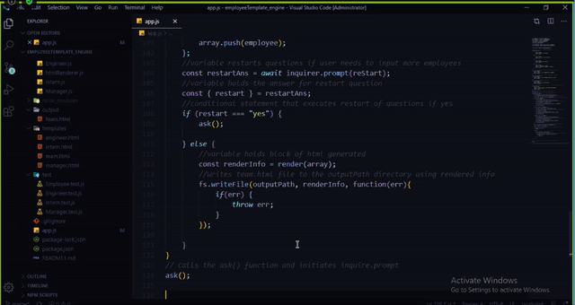
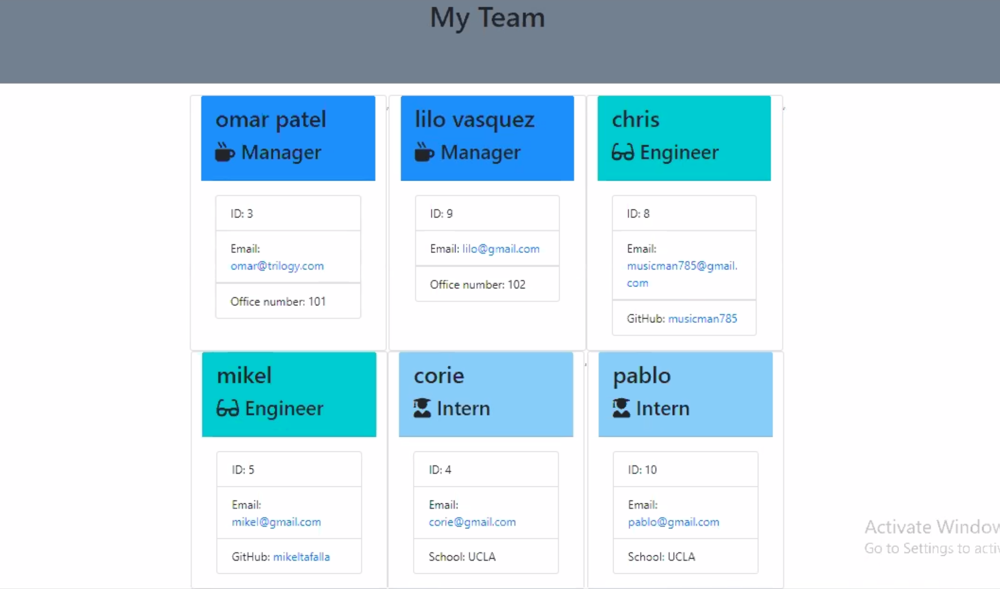

# EmployeeTemplate_engine

Create a command-line application that dyamically generates an employee team-html file. The user will be prompted for employee information pertaining to the employee's role. 

# Table of Contents 

* [Installation](#installation)
* [Instruction](#instructions)
* [Tests](#tests)
* [Author](#author)

# Installation 
> 1. npm init//2. npm install inquirer//3. npm install jest 

# Instructions
> Open your terminal and go inside the repository and locate the app.js file. Type node app.js in your terminal and answer the prompted questions. IMPORTANT: please correctly state role of employee so the proper subsequent questions are prompted. 

## Tests
To run tests and see if they are passing, go to your terminal and type npm run test. This shoule run 4 test suites and 17 total tests.

### Example giffy:

### Example Result:

## Author

**musicman785**

Github: https://github.com/musicman785 

